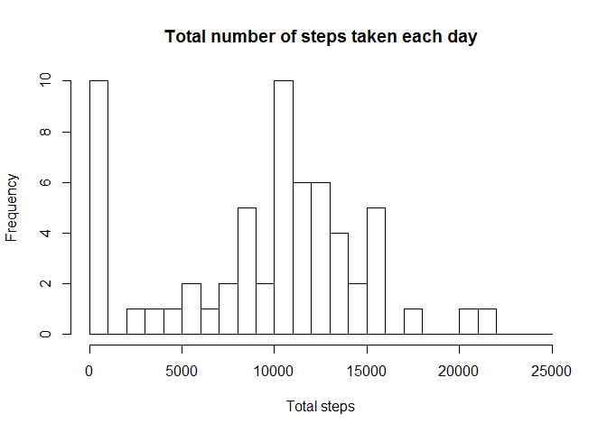
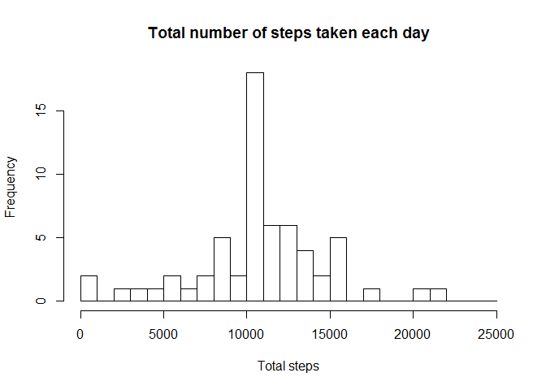
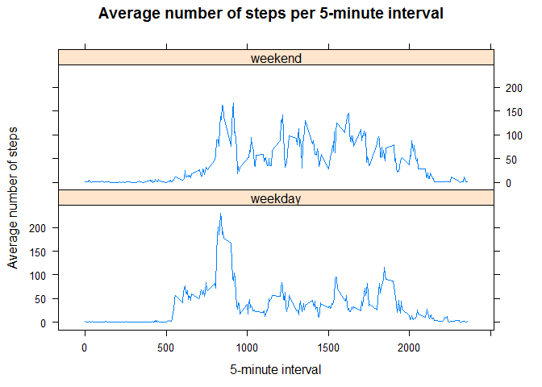

# Reproducible Research: Peer Assessment 1

## Loading and preprocessing the data
* Load the data (i.e. read.csv())

```r
file <- file.path(getwd(), "activity.zip")
if (!file.exists("activity.zip")) {
    url <- "https://d396qusza40orc.cloudfront.net/repdata%2Fdata%2Factivity.zip"
    download.file(url, file)
}
data <- read.csv(unz(file, "activity.csv"),
        header = TRUE,
        colClasses = c("numeric", "character", "numeric"),
        stringsAsFactors = FALSE)
```

* Process/transform the data (if necessary) into a format suitable for your analysis

```r
data$date <- as.Date(data$date, format = "%Y-%m-%d")
```


```r
str(data)
```

```
## 'data.frame':	17568 obs. of  3 variables:
##  $ steps   : num  NA NA NA NA NA NA NA NA NA NA ...
##  $ date    : Date, format: "2012-10-01" "2012-10-01" ...
##  $ interval: num  0 5 10 15 20 25 30 35 40 45 ...
```

```r
head(data)
```

```
##   steps       date interval
## 1    NA 2012-10-01        0
## 2    NA 2012-10-01        5
## 3    NA 2012-10-01       10
## 4    NA 2012-10-01       15
## 5    NA 2012-10-01       20
## 6    NA 2012-10-01       25
```

## What is mean total number of steps taken per day?
* Calculate the total number of steps taken per day

```r
totalStepsPerDay <- tapply(data$steps, data$date, sum, na.rm = TRUE)
head(totalStepsPerDay)
```

```
## 2012-10-01 2012-10-02 2012-10-03 2012-10-04 2012-10-05 2012-10-06 
##          0        126      11352      12116      13294      15420
```

* Make a histogram of the total number of steps taken each day

```r
hist(totalStepsPerDay,
        breaks = seq(from = 0, to = 25000, by = 1000),
        main = "Total number of steps taken each day",
        xlab = "Total steps")
```

 

* Calculate and report the mean and median of the total number of steps taken per day

```r
mean(totalStepsPerDay)
```

```
## [1] 9354.23
```

```r
median(totalStepsPerDay)
```

```
## [1] 10395
```

## What is the average daily activity pattern?
 * Make a time series plot (i.e. type = "l") of the 5-minute interval (x-axis) and the average number of steps taken, averaged across all days (y-axis)

```r
meanStepsPerInterval <- tapply(data$steps, data$interval, mean, na.rm = TRUE)
plot(row.names(meanStepsPerInterval),
        meanStepsPerInterval,
        type = "l",
        main = "Average number of steps per 5-minute interval",
        xlab = "5-minute interval",
        ylab = "Average number of steps")
```

 

* Which 5-minute interval, on average across all the days in the dataset, contains the maximum number of steps?

```r
names(which.max(meanStepsPerInterval))
```

```
## [1] "835"
```

## Imputing missing values
* Calculate and report the total number of missing values in the dataset (i.e. the total number of rows with NAs)

```r
sum(is.na(data$steps))
```

```
## [1] 2304
```

* Create a new dataset that is equal to the original dataset but with the missing data filled in.  
**Use the mean steps per interval for filling the NAs**

```r
data_new <- data
for (row in 1:nrow(data_new)) {
    if (is.na(data_new[row, 1])) {
        data_new[row, 1] <- as.numeric(meanStepsPerInterval[as.character(data_new[row, 3])])
    }
}
```


```r
str(data_new)
```

```
## 'data.frame':	17568 obs. of  3 variables:
##  $ steps   : num  1.717 0.3396 0.1321 0.1509 0.0755 ...
##  $ date    : Date, format: "2012-10-01" "2012-10-01" ...
##  $ interval: num  0 5 10 15 20 25 30 35 40 45 ...
```

```r
head(data_new)
```

```
##       steps       date interval
## 1 1.7169811 2012-10-01        0
## 2 0.3396226 2012-10-01        5
## 3 0.1320755 2012-10-01       10
## 4 0.1509434 2012-10-01       15
## 5 0.0754717 2012-10-01       20
## 6 2.0943396 2012-10-01       25
```

* Make a histogram of the total number of steps taken each day

```r
totalStepsPerDayNew <- tapply(data_new$steps, data_new$date, sum)
head(totalStepsPerDayNew)
```

```
## 2012-10-01 2012-10-02 2012-10-03 2012-10-04 2012-10-05 2012-10-06 
##   10766.19     126.00   11352.00   12116.00   13294.00   15420.00
```

```r
hist(totalStepsPerDayNew,
        breaks = seq(from = 0, to = 25000, by = 1000),
        main = "Total number of steps taken each day",
        xlab = "Total steps")
```

 

* Calculate and report the mean and median total number of steps taken per day.

```r
mean(totalStepsPerDayNew)
```

```
## [1] 10766.19
```

```r
median(totalStepsPerDayNew)
```

```
## [1] 10766.19
```

* Do these values differ from the estimates from the first part of the assignment?

```r
mean(totalStepsPerDayNew) - mean(totalStepsPerDay)
```

```
## [1] 1411.959
```

```r
median(totalStepsPerDayNew) - median(totalStepsPerDay)
```

```
## [1] 371.1887
```

* What is the impact of imputing missing data on the estimates of the total daily number of steps?  
**-> The mean and the median are the same and higher as before**

## Are there differences in activity patterns between weekdays and weekends?
* Create a new factor variable in the dataset with two levels – “weekday” and “weekend” indicating whether a given date is a weekday or weekend day.

```r
data_new$day_type <- ifelse(weekdays(data_new$date) %in% c("Samstag", "Sonntag"), "weekend", "weekday")
data_new$day_type <- factor(data_new$day_type)
str(data_new)
```

```
## 'data.frame':	17568 obs. of  4 variables:
##  $ steps   : num  1.717 0.3396 0.1321 0.1509 0.0755 ...
##  $ date    : Date, format: "2012-10-01" "2012-10-01" ...
##  $ interval: num  0 5 10 15 20 25 30 35 40 45 ...
##  $ day_type: Factor w/ 2 levels "weekday","weekend": 1 1 1 1 1 1 1 1 1 1 ...
```

* Make a panel plot containing a time series plot (i.e. type = "l") of the 5-minute interval (x-axis) and the average number of steps taken, averaged across all weekday days or weekend days (y-axis).

```r
meanStepsPerIntervalNew <- aggregate(steps ~ interval + day_type, data = data_new, mean)
library(lattice)
xyplot(steps ~ interval | day_type,
        data = meanStepsPerIntervalNew,
        type = "l",
        layout = c(1, 2),
        main = "Average number of steps per 5-minute interval",
        xlab = "5-minute interval",
        ylab = "Average number of steps")
```

 
